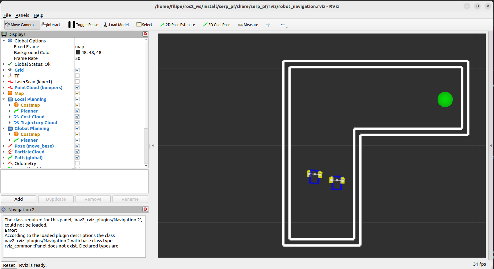
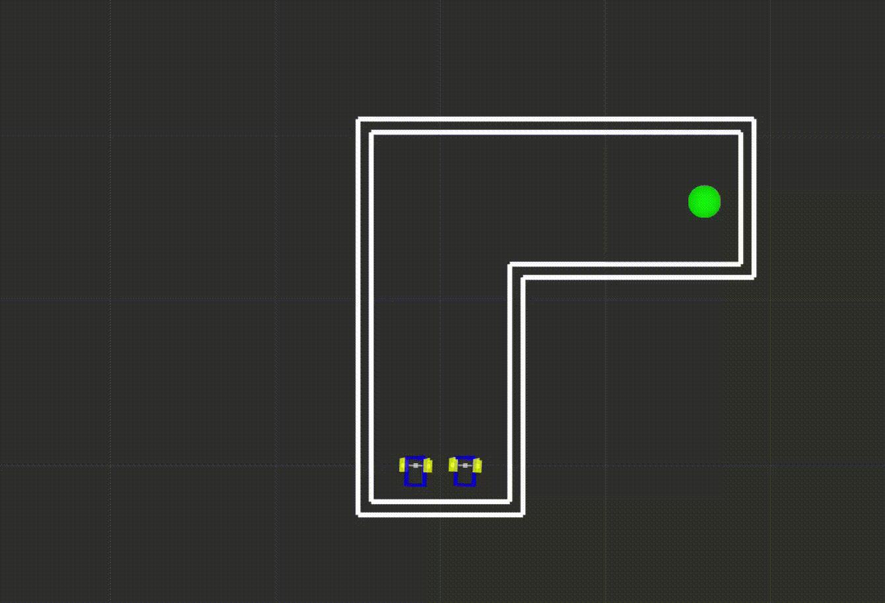
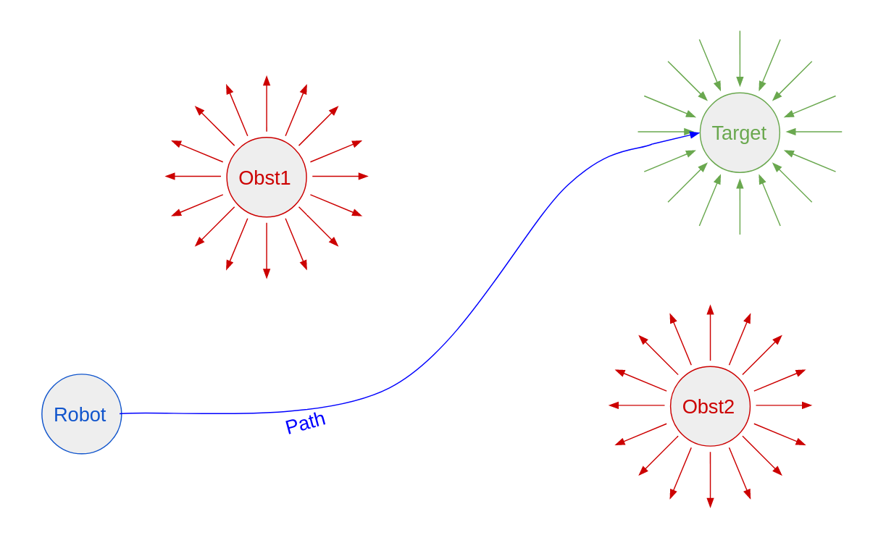
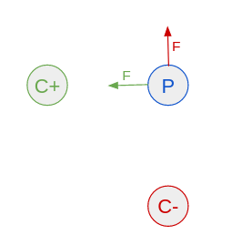
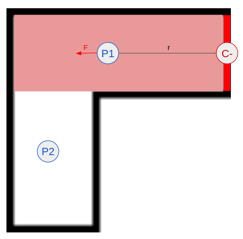
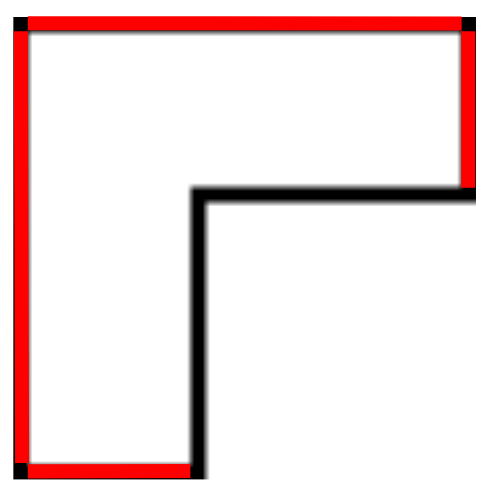
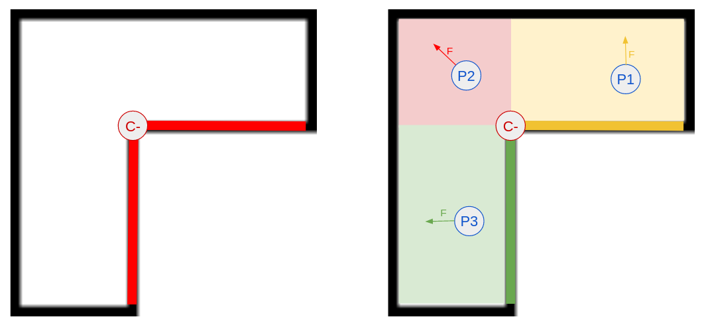
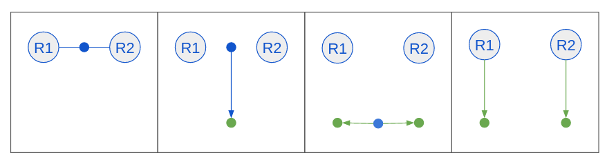

# Flatland Artificial Potential Fields Tutorial using ROS 2

This tutorial will teach you a reactive alterative to using Reinforcement Learning that was explained in the [previous tutorial](https://github.com/FilipeAlmeidaFEUP/ros2_flatland_rl_tutorial) for robot navigation. Here you will learn how to use the Artificial Potential Fields algorithm to make a pair of robots navigate from one side of a hallway with a 90º turn to the other while travelling side by side.

There are some differences in the setup that will be explained in [this section](#new-flatland-and-ros-2-setup)

### Running the code

First make sure you have the transforms3d module install by running:

```
sudo pip install transforms3d
```

Then clone the repository to your `<ros2_workspace>/src` folder:
```
git clone https://github.com/FilipeAlmeidaFEUP/ros2_flatland_pf_tutorial.git
```

Build the project and install dependencies:
```
rosdep install -i --from-path src --rosdistro humble -y
colcon build
source install/setup.bash
```

Run the launch file:
```
ros2 launch serp_pf serp_pf.launch.py
```

At this point, if no errors occur, you should be seeing the following world:





Just like in the RL tutorial, the start is in one end of the hallway and the target position is on the other, but now there are two robots travelling side by side. Collisions or reaching the end, will reset the environment and switch the starting and target positions.

The main difference is the way the robot is deciding where to move at any point. Instead of using RL algorithm to decide, it's using the Artificial Potential Fields algorithm. More on this in [this section](#artificial-potential-fields).

## New Flatland and ROS 2 setup

This package is very similar to the one on the [previous tutorial](https://github.com/FilipeAlmeidaFEUP/ros2_flatland_rl_tutorial) but without the RL components. That being said, there are some important small changes that should be highlighted.

### Using local python modules

In your python code, you can import any module that you would be able to import in any other python project. You can also import modules from local files on your own machine but that will take a few extra steps to work in ROS 2. 

First you need to add the folder of the module to the folder of the controller python code (which is the folder with the same name as the package; [example in this package](serp_pf/)). Each new folder also needs to contain a file called \_\_init\_\_.py, which can be left empty or used as a regular python file. Your code folder should look something like this:

```
├── <ros_package_name>
│   ├── __init__.py * 
│   ├── <another_py_file>.py
│   ├── <py_module1>
│   │   ├── __init__.py *
│   │   ├── <py_file1>
│   │   ├── <py_file2>
│   ├── <py_module2>
│   │   ├── __init__.py *
│   │   ├── <py_file3>

* required files
```

After that, the setup file needs to be updated. First the ```packages``` variable needs to contain all added modules and then folders need to be shared by adding them to ```data_files```. For the example presented before:

```
setup(
    [...]
    packages=['<ros_package_name>', '<ros_package_name>/<py_module1>', '<ros_package_name>/<py_module2>'],
    data_files=[
        [...]
        ('share/<ros_package_name>/<ros_package_name>/<py_module1>/ , glob('<ros_package_name>/<py_module1>/*')),
        ('share/<ros_package_name>/<ros_package_name>/<py_module2>/ , glob('<ros_package_name>/<py_module2>/*')),
    ],
    [...]
)
```

Now you can access the modules inside you controller python code. One local module called [charges](serp_pf/charges/) was added in this package and contains auxiliary classes and methods for the Artificial Potential Fields algorithm.

### Callback method with arguments

Callback methods are the function that is passed as an argument when a subscriction to a topic is made. Each time the topic publishes a message, this method is called. By default it can only have one agument, which is the message published. But, in ROS 2, through the use of the [python lambda functions](https://www.w3schools.com/python/python_lambda.asp), it is possible to send more arguments.

```
self.create_subscription(<MsgType>, topic, lambda msg: callback_method(msg, arg), 1)

def callback_method(msg, arg):
    [...]
```

In this package this was used in the callback function for odometry subscriptions (robot position). Since there are two robots, the same function could be used and the extra argument served to know which robot the message came from.

```
[...]

self.create_subscription(Odometry, "/odom1", lambda msg: self.updatePosition(msg, "serp1"), 1)
self.create_subscription(Odometry, "/odom2", lambda msg: self.updatePosition(msg, "serp2"), 1)

[...]

def updatePosition(self, data, model):
    [...]
```

### Using multiple robots

Using multiple robot models in Flatland is for the most part not a problem since you just need to add model entries in the world file. The only issue in the Flatland configuration is that only in very rare situations the same model file can be used to generate several models in the world. This happens because the model file configures its interactions with layers and the topics it publishes and subscribes to. For example, you can never control 2 robots independently if they were generated by the same file.

In this package, the two Serp models have exactly the same chape and same type of plugins, but they need different:
- topics to subscribe to [Twist messages](http://docs.ros.org/en/melodic/api/geometry_msgs/html/msg/Twist.html)(move the robot).
- topics to publish [Odometry messages](https://docs.ros2.org/foxy/api/nav_msgs/msg/Odometry.html)(position of the robot).
- interactions with layers, since the end beacon LiDAR can only detect one of them.

For these reasons, two model files had to be configured, [serp1](world/serp1.model.yaml) and [serp2](world/serp2.model.yaml).

## Artificial Potential Fields

Unlike RL algorithms, Artificial Potential Fields(APF) is a reactive method. This means that, similarly to RL, it chooses an action for each state that it encounters and the difference is in a way it chooses an action. While RL algorithms use trial and error to learn over time the best action for each state, APF works like function that receives the state and computes an action. Since the same state will allways produce the same action, it does not require any training.

APF is used for robot path planning by determining, at any point on the map, where the robot needs to go. This is possible by filling the map with electrical charges, adding repulsive charges where there are obstacles and an attractive charge to the target. The sum of all the forces determines the force and, from that, the acceleration for the robot, eventually leading it to the goal. The following image shows a representation of the path planning in APF.



### Placing charges on the map

For APF to work, it's necessary to define where the charges need to be placed and how they interact with the robots. Depending on shape of the obstacle, the electric field produced will be different. For this map, three different types of charges were created:

- Point Charge
- Line Segment Charge
- Composite Charge

These types of charges are represented by python classes in the file [charges.py](serp_pf/charges/charges.py).

NOTE: The robots themselves should also have a charge but for simplicity lets consider a positive charge attracts the robot and a negative one repels it.

#### Point Charge

A charge represented by:
- a point in space
- an intensity

For any point in space P and point charge C the Force in P is defined by its orientation and magnitude.

The orientation is given by:
$$tan^{-1}\left(\frac{C.y-P.y}{C.x-P.x}\right)$$

And the magnitude is given by Coulomb's law:
$$F = k \frac{q_1q_2}{r^2}$$

where:
- k is the Coulomb constant. Essential when using actual electrical fields but here can be simplified to 1.
- q1 is the intensity of the charge in P, which in this case will be the position of the robot. As stated before, the robot charge will be ignored so it can also be simplified to 1.
- q2 is the intensity of the charge.
- r is the distance from P to C

So the final magnitude formula is:
$$F = \frac{C.intensity}{Euclidean\_distance(P,C)}$$

F will be positive or negative based on signal the intensity. If positive, when returning the x and y components, they will be in the direction of the charge and , if negative, they will be in the opposite direction. The following image demonstrates how Point Charges a point in space.



A positive Point Charge is used on the target position to attract the robot to it.

#### Line Segment Charge

A charge represented by:
- a pair of point in space that define the line segment
- an intensity

For any point in space P and line segment charge C the Force in P is calculated by determining the intersection between the line segment and the line perpendicular to C that passes through P. Then a temporary charge is placed in that point with C.intensity and is used to determine the force. If the line doesn't intersect, the forrce has magnitude of 0 (no force).

The following image demonstrates how a Line Segment Charge affect points in space.



These Line Segments Charges are the ones used to represent the walls of the map:



#### Composite Charge

A charge represented by:
- a set of Line Segment Charges and Point Charges
- an intensity

For any point in space P and composite charge C the Force in P is determined by only one of the charges contained in C. If P is in one of the zones affected by one of the line segments, then that line segment is the charge that determines the force. If not, It is determined by the closest point charge.

The following figure represents the only composite charge contained in the map on the left and how it affects points in space on the right.



### Calculate the Robots Speeds

After placing the charges on the map, the goal is to determine how the robots should be moving at any given time. The APF algorithm says that to determine the trajectory for the robot, we only need to add all the forces from the charges on the current robot position and that will give us the acceleration. This is not taking into aaccount some problems in this specific setup:

- We have two robots that need to reach the target while travelling side by side.
- Because the robots are differential drive robots, they need to be facing the target before they can start moving.
- The Diff Drive plugin in Flatland does not have an acceleration, only linear speed.

Lets tackle these issues one at a time.

#### Moving Robots side by side 

To allow for the robots to move side by side, we need to make sure they can navigate through the map independently while also leaving room the other one. To do this, we need to start by thinking of the pair of robots as one unified component and determine the position where each one needs to be in order to move towards the target while being next to eachother. This can be achieved by:

1. Finding the middle point of the positions of both robots.
2. Calculate the resulting forces from all the map charges (with a positive charge in the target position) and add the force vector to get a target middle point.
3. From the target middle point, find the target point for each robot. This is done by shifting the target middle point by half the ideal distance between the robots in both ways of the direction perpendicular to the force vector found in step 2.

The following image ilustrates these steps.



In this to new poits found, we can create Tension Points. Tension Points work exactly like Point Charges but the magnitude of the force is calculated by Hooke's law (used for spring extension) instead:

$$F = kr$$

Where:
- k is a constant factor characteristic of the spring. Can be replaced by the intensity.
- r is the distance from the robot to the tension point

Opposed to Coulomb's law, the larger the distance, the greater the force.

To determine the force in each robot, in the point wherre the robot is:
- Add the forces from all the wall charges.
- Add force from a negative charge in the position of the other robot. This is to avoid collisions between them.
- Add the force from the newly found Tension points.

#### Rotate to face the target 

For differential drive robots to move in a specific direction, they need to be facing the right way first. This means that if a robot does not have the same rotation as the angle of the force that was calculated to it, it only has angular speed. Only when it is facing the right way, it can move forward, using only linear speed.

To make sure they won't get to far appart from each other, the robots can only have linear speed if both are facing the right direction and are ready to move forward.

#### Using the Force magnitude for the linear speed

The angle of the force on each robot determines the direction they need to be moving to. The magnitude should determine the acceleration of the linear velocity but Flatland does not use acceleration. The magnitude should still be taken into account though, since if one of the robots is behind, it needs to catch up to the other one. In this example, the magnitude of both forces was used to determine the ratio of both linear speeds. The robot with the strongest Force sum is assinged a maximum linear speed, while the other has a smaller one that maintains the ratio of the forces.

### Limitations of APF

At first glance, the APF algorith might look better than using RL, since it was able to perfectly perform a task without requiring any training. This is why it is important to recognize a major issue with APF: it requires perfect knowledge of the map, robots positions and the target location. 

A RL agent can train in a map and then be placed in a new one and, if the new map shares some features with the one he trained in, he might be able to still perform the task.

In APF, if you want to use a new map, the whole setup needs to be changed (new charge layout).

## Next steps

Now that you understand how the APF algorithm works, you can make your own map and create a new charge layout for it. Then try to adjust the intensity values so that the robot can reach the end goal.
